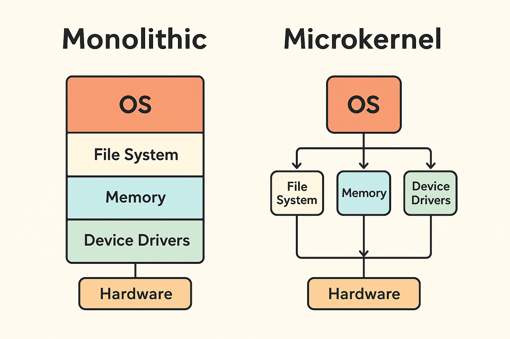

Do you want me to make quick diagrams (Monolithic vs Microkernel) so it becomes even easier to visualize?avGot it Ajith 🌟 — you want to **learn and master Monolithic vs Microkernel architecture in Operating Systems**, but in a **child-like simple way** so it sticks for placements. Let’s go step by step, like a story 📖

---

# 🎯 Step 1: What are we talking about?

Think of an **Operating System (OS)** as the **boss of your computer**.
The OS decides:

* who gets to use the CPU 🧠,
* how memory 🗄️ is shared,
* how files 📂 are managed,
* how devices (keyboard, printer, etc.) work.

Now, the way the OS is **designed inside** can follow two main styles:
👉 **Monolithic Architecture**
👉 **Microkernel Architecture**

---

# 🎯 Step 2: The Story (Child-friendly example)

### 🍲 Monolithic Kernel = “Big Kitchen Restaurant”

* Imagine a **restaurant kitchen** where **everything is done in one big hall**:

  * Chefs cook 🥘
  * Cleaners wash 🍽️
  * Managers take orders 📝
  * Cashiers handle money 💵
* All working together in the same place, quickly passing things.

✅ **Advantages**:

* Very **fast**, because everyone is in the same kitchen.
* Easy communication (just shout to the next person).

❌ **Disadvantages**:

* If one chef spills soup 😱 → the **whole kitchen gets messy** (one bug crashes the whole system).
* Hard to manage when the kitchen becomes very large.

---

### 🏠 Microkernel = “Separate Rooms House”

* Now imagine a **house** where each task is in a **separate room**:

  * One room for cooking 🍳
  * One room for cleaning 🧹
  * One room for cash handling 💰
* To talk, they **send messages (letters)** through the hallway 📩.

✅ **Advantages**:

* If the cooking room has a fire 🔥, the cleaning room is still safe → system is more **stable and secure**.
* Easier to add/remove new rooms (flexibility).

❌ **Disadvantages**:

* **Slower**, because sending messages between rooms takes time.
* More complex design.

---

# 🎯 Step 3: Technical Explanation (Placements level)

| Feature         | Monolithic Kernel                                                                  | Microkernel                                                                                 |
| --------------- | ---------------------------------------------------------------------------------- | ------------------------------------------------------------------------------------------- |
| **Structure**   | All OS services (file system, memory, device drivers, etc.) run in **kernel mode** | Only essential services (CPU scheduling, memory, IPC) in kernel mode, rest in **user mode** |
| **Speed**       | Faster (direct function calls)                                                     | Slower (message passing)                                                                    |
| **Reliability** | Less reliable (one bug → system crash)                                             | More reliable (fault isolation)                                                             |
| **Size**        | Large kernel                                                                       | Small kernel                                                                                |
| **Examples**    | Linux, Unix                                                                        | QNX, Minix, MacOS (hybrid, mostly microkernel)                                              |

---

# 🎯 Step 4: Placement Friendly Q\&A

💡 **Q1:** Why is microkernel more secure than monolithic?
👉 Because in microkernel, services run separately in **user space**, so one service crash won’t crash the entire OS.

💡 **Q2:** Why is monolithic faster?
👉 Because all services run in **kernel space** and communicate directly, no extra messaging.

💡 **Q3:** Which one does Linux use?
👉 **Monolithic** (but modular).

💡 **Q4:** Which kernel is good for embedded systems?
👉 **Microkernel**, because of reliability and modularity.

---

# 🎯 Step 5: How to Master It

1. **Start with analogy** (Restaurant vs House 🏠).
2. **Draw diagrams** in notes (one big block vs small blocks with arrows).
3. **Practice comparison table** (must know for placements).
4. **Prepare 2–3 real-world examples** (Linux = Monolithic, QNX = Microkernel).
5. Revise daily in **5 minutes flashcards**.

---

✨ Done! You can now **explain kernels to anyone like a story** and also crack placement-level MCQs.

Do you want me to **make quick diagrams (Monolithic vs Microkernel)** so it becomes even easier to visualize?

Perfect Ajith 🌟 — let’s train you with **complex MCQs** on Monolithic vs Microkernel architectures, just like they may ask in **placements**.
I’ll give you **questions first**, and then the **answers at the end** (so you can try yourself).

---

## 🔥 Complex MCQs (Monolithic vs Microkernel)

**Q1.** Which of the following statements is TRUE about **Monolithic kernels**?
A) All operating system services run in user space.
B) Device drivers run in kernel space.
C) Inter-process communication is achieved via message passing.
D) Monolithic kernels are always slower than microkernels.

---

**Q2.** In a **microkernel**, most of the OS services like file system and device drivers run in:
A) Kernel mode
B) User mode
C) Supervisor mode
D) Hypervisor mode

---

**Q3.** Why are **microkernels** considered more secure than monolithic kernels?
A) They have smaller code base in kernel space.
B) They execute faster system calls.
C) They do not require device drivers.
D) They use paging instead of segmentation.

---

**Q4.** Which of the following is a **disadvantage** of microkernel architecture?
A) Poor modularity
B) System crash if one module fails
C) Higher communication overhead due to message passing
D) Inflexibility in adding new services

---

**Q5.** Linux kernel is best classified as:
A) Pure monolithic kernel
B) Pure microkernel
C) Modular monolithic kernel
D) Hybrid microkernel

---

**Q6.** Suppose a driver crashes in a **monolithic kernel**. What is the most likely consequence?
A) The system continues to work unaffected.
B) Only the driver is terminated, system remains stable.
C) The whole operating system may crash.
D) The driver restarts automatically in user mode.

---

**Q7.** Which one of the following OS uses a **microkernel** architecture?
A) Windows XP
B) Linux
C) MINIX
D) MS-DOS

---

**Q8.** Which of the following is the **main reason** why Monolithic kernels are faster than Microkernels?
A) Larger code base
B) Direct system calls without message passing
C) More hardware support
D) Better modularity

---

## ✅ Answers (Don’t peek until you try!)

1 → B
2 → B
3 → A
4 → C
5 → C
6 → C
7 → C
8 → B

---

Do you want me to also make a **short “Placement Cheatsheet” (like 1-pager quick notes + diagrams)** on Monolithic vs Microkernel that you can revise the night before interview?
