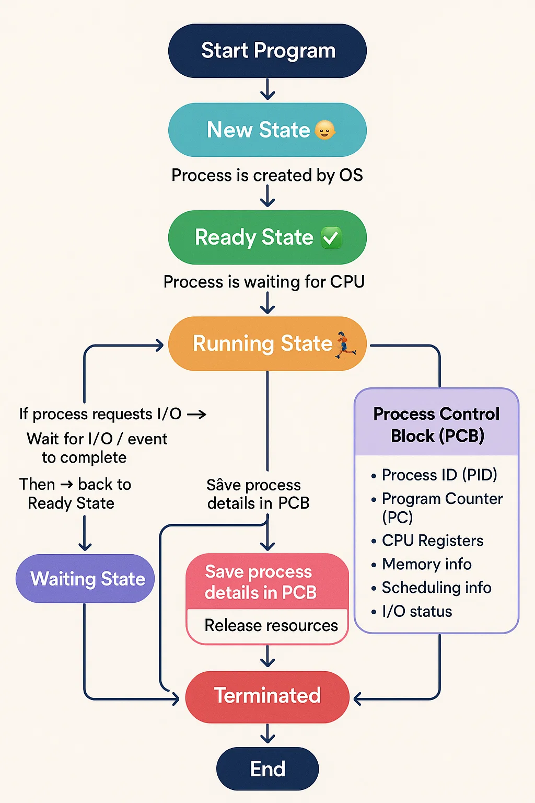

Alright Ajith 🌟 — let’s **deep dive into Process States & Process Control Block (PCB)** step by step, but in a **child-like, story style** so it becomes super clear. Later we’ll go into **in-depth (placement level)** details.

---

# 🧑‍🏫 Step 1: What is a Process?

👉 A **process** is just a **program in execution**.

* A program = recipe 📖
* A process = chef actually cooking that recipe 👨‍🍳

So the OS must keep track of all these “chefs” working at the same time. That’s where **process states** and **PCB** come in.

---

# 🎯 Step 2: Process States (like moods of a chef)

Imagine a chef cooking food. Depending on the situation, the chef can be in different **moods (states)**:

1. **New 👶**

   * Process is just created.
   * Example: Chef is hired but not started cooking yet.

2. **Ready ✅**

   * Process is ready to run but waiting for CPU.
   * Example: Chef is standing in line, ready to start cooking.

3. **Running 🏃**

   * Process is currently using CPU.
   * Example: Chef is actively cooking a dish.

4. **Waiting ⏳ / Blocked 🚫**

   * Process is waiting for some event (like I/O).
   * Example: Chef is waiting for ingredients (e.g., vegetables from store).

5. **Terminated 💀**

   * Process has finished execution.
   * Example: Chef has cooked and gone home.

(Some OSes also include **Suspended** state: Chef takes a break 💤).

---

# 🎯 Step 3: Process Control Block (PCB) = Chef’s ID Card 🪪

Now the OS must **remember details about each process**.
Think of the PCB as a **detailed ID card or file** about the chef (process).

The PCB contains:

1. **Process ID (PID)** 🆔

   * Unique number to identify the process.

2. **Process State** 🟢🔴

   * New, Ready, Running, Waiting, Terminated.

3. **CPU Registers + Program Counter (PC)** 🧠

   * Where the process left off, so it can resume cooking from same step.

4. **CPU Scheduling Info** ⏱️

   * Priority, queue position.

5. **Memory Info** 🗂️

   * Base and limit registers, memory map (where ingredients are kept).

6. **I/O Status Info** 💾

   * Which files/devices the process is using.

7. **Accounting Info** 🧾

   * CPU time used, process start time, etc.

---

# 🎯 Step 4: Why are States & PCB Important?

* The OS switches between processes using **Context Switching**.
* When it stops one process, it saves its details in the **PCB**.
* Later, it reloads from PCB so the process can continue exactly where it left.

👉 Without PCB, it’s like a chef leaving the kitchen without writing where he stopped → next time he won’t know if the onions are already chopped!

---

# 🎯 Step 5: Placement-ready Q\&A

💡 **Q1:** What are the main process states in an OS?
👉 New, Ready, Running, Waiting, Terminated.

💡 **Q2:** What is the purpose of a PCB?
👉 PCB stores all information about a process (ID, state, registers, memory, I/O, scheduling info).

💡 **Q3:** How does PCB help in context switching?
👉 It saves the process’s CPU state when switching out, and restores it when switching back.

💡 **Q4:** Is PCB stored in user space or kernel space?
👉 **Kernel space** (because only the OS should manage process details).

---

⚡ Quick Visual:

* **Process = Chef cooking**
* **State = Chef’s mood (new, ready, running, waiting, finished)**
* **PCB = Chef’s diary/ID card with cooking progress**

---

Would you like me to **draw a simple diagram (Process State Transition + PCB structure)** so you can visualize this better for memory retention and revision?
Perfect Ajith 🚀 — let’s test your **in-depth knowledge of Process States & PCB** with **complex MCQs** (like in placements).
I’ll list the questions first, then give the **answers at the end** ✅.

---

# 🔥 Complex MCQs on Process States & PCB

**Q1.** During a **context switch**, which of the following is saved in the **Process Control Block (PCB)?**
A) Program Counter, CPU registers, process state
B) Only the Process ID and priority
C) Only the page table entries
D) Only the I/O status of the process

---

**Q2.** A process is in the **waiting state**. Which event can move it back to the **ready state**?
A) Completion of its CPU burst
B) Availability of required I/O
C) Process termination
D) Dispatch by the scheduler

---

**Q3.** Which of the following **does not belong** in a PCB?
A) Process state
B) Program counter
C) CPU scheduling information
D) Source code of the program

---

**Q4.** Suppose process **P1** is running and an **I/O request** is made. What happens?
A) P1 moves to Ready state
B) P1 moves to Waiting state
C) P1 remains in Running state until I/O completes
D) P1 is terminated

---

**Q5.** Which of the following is **true** about PCB storage?
A) PCB is stored in user space for fast access
B) PCB is stored in kernel space for protection
C) PCB is stored in CPU registers
D) PCB is stored in I/O devices

---

**Q6.** In a **Round Robin scheduling**, what information in PCB is crucial to resume a process correctly?
A) CPU registers and Program Counter
B) I/O device queue
C) Source code of process
D) Disk usage info

---

**Q7.** Consider a process in the **Ready state**. Which of the following conditions will move it to the **Running state**?
A) Completion of I/O
B) Termination of another process
C) Dispatcher assigns it CPU
D) Priority change in PCB

---

**Q8.** In a multiprogramming environment, why is PCB **critical**?
A) It ensures processes don’t overwrite each other’s memory.
B) It prevents deadlocks.
C) It allows context switching by storing execution details.
D) It prevents I/O devices from being idle.

---

# ✅ Answers

1 → A
2 → B
3 → D
4 → B
5 → B
6 → A
7 → C
8 → C

---

⚡ Ajith, these MCQs are at **interview + GATE-level depth**.
Do you want me to now create a **diagram-based question set** (like “Here’s a process state diagram — tell me transitions”)? That’s a common placement trick.
