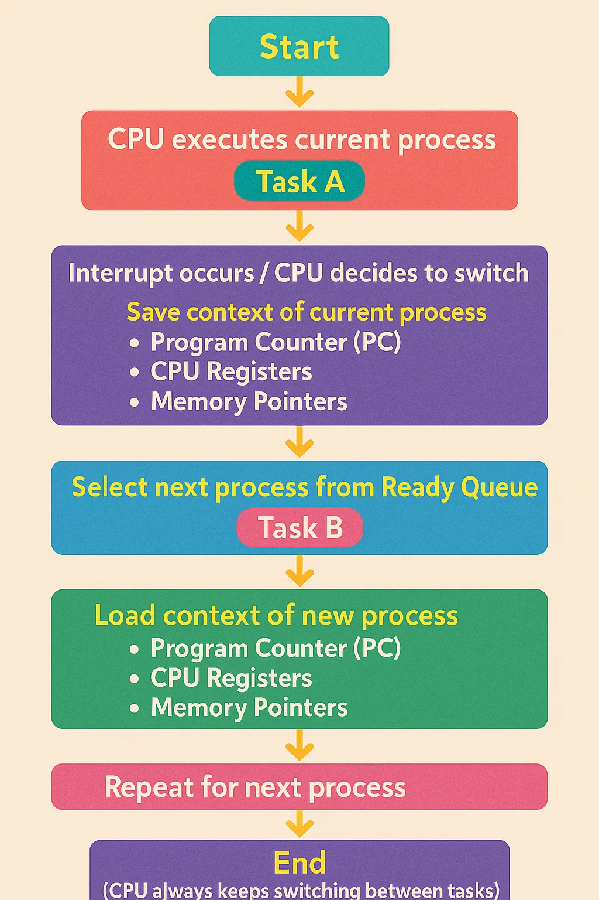

Perfect! Let’s start learning **Context Switching** in Operating Systems step by step, in the simplest way possible—as if I’m explaining to a child. 🧸

---

## **1️⃣ What is Context Switching?**

Imagine you are **playing with toys**, but your mom calls you to eat. You **pause your game**, go eat, and then **resume your game from exactly where you left off**.

In **computers**, a **CPU** (the brain of the computer) does something similar:

* The CPU is like your brain.
* It works on **one task (process)** at a time.
* When the CPU switches from one task to another, it has to **remember where it left off** the first task.

This **saving and loading of tasks** is called **Context Switching**.

---

## **2️⃣ Why do we need Context Switching?**

A CPU is **super fast**, but we often have **multiple tasks**:

* Watching a video
* Downloading a file
* Playing a game

The CPU can **only do one thing at a time**, but by **switching fast** between tasks, it feels like it is **doing everything at once** (this is called **multitasking**).

**Context Switching makes multitasking possible.**

---

## **3️⃣ What is a “Context”?**

The **context** of a process is **everything the CPU needs to continue a task**:

1. **Program Counter (PC)** – “Where was I in the task?”
2. **CPU Registers** – “What values was I using?”
3. **Memory pointers** – “Where is my data?”

Think of it as **your backpack**: when you pause playing, you put all your toys and notes in the backpack. When you resume, you take everything back out.

---

## **4️⃣ How does Context Switching happen?**

Step by step:

1. **Save the context** of the current process (like packing your backpack).
2. **Pick another process** from the ready queue (tasks waiting to run).
3. **Load the context** of the new process (like unpacking its backpack).
4. **CPU starts executing** the new process.

This happens **very fast**, millions of times per second.

---

## **5️⃣ Types of Context Switching**

1. **Process-Level Context Switching**

   * Switching between **two different programs or tasks**.
   * Example: Watching YouTube → Answering WhatsApp messages

2. **Thread-Level Context Switching**

   * Switching between **threads of the same program**.
   * Example: A video player program having **download thread** and **playback thread**

---

## **6️⃣ Overhead of Context Switching**

Context switching is **not free**. It takes some time because the CPU has to:

* Save registers
* Update memory maps
* Load new registers

Too much context switching can **slow the CPU**, like switching games too often without finishing anything.

---

## **7️⃣ Visual Example**

```
Time ------>
| Task A | Task B | Task A | Task C |
```

* CPU works on Task A, then B, then A again, then C.
* Every switch = **context switching**.

---

## **8️⃣ Key Points to Remember**

* **Context** = state of the CPU for a task
* **Context Switching** = saving one task’s state & loading another
* **Why?** To achieve multitasking
* **Overhead** = takes CPU time, so don’t switch too much

---

If you want, I can **draw a super simple diagram showing how context switching works** step by step—it makes it **easy to remember** for placements.

Do you want me to do that? 🎨
