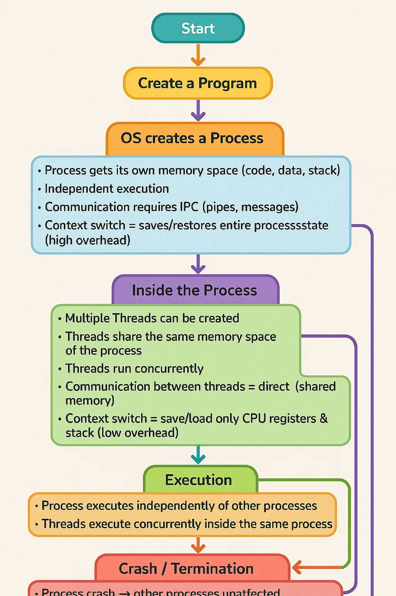

Absolutely! Let’s learn **Threads vs Processes** in **Operating Systems** step by step, in the simplest way possible—as if I’m explaining to a child. 🧸

We’ll also focus on what’s **important for placements**.

---

## **1️⃣ What is a Process?**

Imagine a **process** as a **complete game** on your tablet:

* Each game has **its own rules, memory, and progress**.
* It runs **independently** of other games.
* If one game crashes, **other games are not affected**.

In computers:

* A **process** is an **independent program** being executed.
* It has its **own memory space** (code, data, stack).
* Examples: Google Chrome, Notepad, VLC Media Player.

---

## **2️⃣ What is a Thread?**

Now imagine inside your game, you have **mini-tasks** happening at the same time:

* Background music playing 🎵
* Character moving 🚶
* Score updating 🏆

Each mini-task is a **thread**:

* A **thread** is a **lightweight task** inside a process.
* Threads **share the same memory** of the process.
* Threads allow a program to **do multiple things at once**.

---

## **3️⃣ Key Differences: Threads vs Processes**

| Feature       | Process                                    | Thread                                   |
| ------------- | ------------------------------------------ | ---------------------------------------- |
| Memory        | Separate memory space                      | Shared memory within process             |
| Overhead      | High (context switch costly)               | Low (faster context switch)              |
| Communication | Inter-process communication needed         | Can communicate directly (shared memory) |
| Crash impact  | Crash of one process doesn’t affect others | Crash of thread can crash whole process  |
| Creation      | Slower (OS allocates memory, resources)    | Faster (uses existing process resources) |
| Example       | Chrome browser                             | Each tab or background task in Chrome    |

---

## **4️⃣ Why Threads Exist?**

Threads exist to make programs **faster and more responsive**:

* **Multitasking within a program**: Playing music while typing
* **Efficient CPU usage**: CPU switches between threads faster than switching between processes
* **Resource sharing**: All threads can access the same data without extra effort

---

## **5️⃣ How Threads and Processes Work Together**

Imagine a **restaurant analogy**:

* **Process** = a restaurant (it has its own kitchen, staff, resources)
* **Threads** = chefs in the restaurant

  * Each chef can cook a dish independently, but they share the **same kitchen and ingredients**
* If the restaurant closes (process ends), all chefs stop cooking (all threads die)

---

## **6️⃣ Context Switching: Threads vs Processes**

* **Process-level context switch**: Saving/loading **entire memory, registers, stack** → **slower**
* **Thread-level context switch**: Only saving/loading **registers and stack pointer** → **faster**

---

## **7️⃣ Placement Tips: Key Points to Remember**

1. **Process = Independent program; Thread = Lightweight task inside a program**
2. Threads **share memory**, processes **don’t**
3. Threads are **faster to create and switch**, processes are **slower**
4. **Thread crash** → may affect whole process; **Process crash** → others unaffected
5. **Inter-thread communication** is easier; **Inter-process communication** is complex

---

I can also **draw a simple diagram comparing processes and threads**, with **memory, stack, and CPU registers**—this is perfect to **remember and answer tricky placement questions**.

Do you want me to make that diagram? 🎨

Awesome! 🎉 Let’s solve all these kid-style but **placement-smart questions** one by one. 🧸

---

### **Question 1**

If I have two programs running on my computer, are they threads or processes? Why?

✅ **Answer:** They are **processes**.
👉 Because each program runs independently with its **own memory space, resources, and execution environment**. Threads exist **inside a process**, not across different programs.

---

### **Question 2**

Inside a game, the background music keeps playing while I move my character. Is the music a thread or a process? Why?

✅ **Answer:** It’s a **thread**.
👉 Both music and character movement belong to the **same game (process)**. They are handled by **separate threads** so they can run **concurrently** inside the same program.

---

### **Question 3**

Which one is faster to switch on the CPU: a thread or a process? Why?

✅ **Answer:** **Thread switching** is faster.
👉 Because threads **share the same memory space** of a process, so only **registers and stack pointers** need to be saved/restored.
👉 Process switching requires saving and loading **entire memory maps, resources**, which is heavier.

---

### **Question 4**

If a thread crashes, what happens to the rest of the threads in the same process? What about a process crash?

✅ **Answer:**

* If a **thread crashes**, it can **bring down the entire process** since all threads share the same memory.
* If a **process crashes**, **all its threads die** (because threads cannot exist without their parent process).

---

### **Question 5**

I want to share my toys between friends in my game. Who can share memory easily: threads or processes? Why?

✅ **Answer:** **Threads** share memory easily.
👉 All threads inside a process share the **same address space**.
👉 Processes have **separate memory spaces**, so sharing requires **Inter-Process Communication (IPC)** (pipes, sockets, etc.), which is more complex.

---

### **Question 6**

If I have 1000 mini-tasks inside one program, is it better to use 1000 threads or 1000 processes? Why?

✅ **Answer:** **1000 threads** are better.
👉 Threads are **lightweight**, faster to create, and they share resources.
👉 1000 processes would be very heavy, since each process requires **separate memory and context switching overhead**.

---

## 🎯 Placement Takeaway

* **Processes = Independent programs**
* **Threads = Mini-tasks inside a process**
* **Threads share memory, processes don’t**
* **Threads are lightweight, processes are heavyweight**
* **Thread crash → process crash; Process crash → all its threads die**

---

Would you like me to now create a **tricky placement-style MCQ set (with calculations, crash scenarios, and scheduling)** on **Threads vs Processes** like we did for Context Switching?
