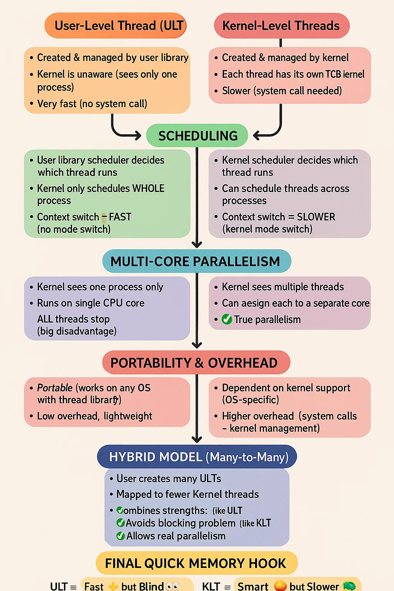

Alright AJITH 👌 Let’s break **User-level vs Kernel-level Threads** into a **child-level story** first, then slowly go **in-depth** so you’ll master it for **placements**. 🚀

---

# 🧒 Child-Level Story

👉 Imagine your computer is a **school**.

* **Students** = Threads (they do the work).
* **Teacher** = CPU (decides who works now).
* **Principal** = Operating System Kernel (big boss).

Now, there are two types of classes:

---

### 1. **User-level Threads (ULT)** – "Self-managed group of students"

* Here, **students manage themselves** without the principal knowing.
* The teacher only sees **one big student (the whole class)**, not the small students inside.
* If one student falls asleep 😴 (blocked), the **whole class stops working** because the teacher doesn’t know about the others.

🔑 **Example:** Old libraries like POSIX Pthreads (in pure user mode).

---

### 2. **Kernel-level Threads (KLT)** – "Principal manages every student"

* Here, **principal (Kernel)** knows each student individually.
* The teacher (CPU) can directly call any student to work.
* If one student sleeps, the teacher can tell **another student** to continue.

🔑 **Example:** Windows, Linux (modern systems)

---

✅ So the **difference** is **who controls the students (threads)**:

* **User-level:** Students manage themselves → Principal doesn’t know.
* **Kernel-level:** Principal controls each student → Better, but costly.

---

# 📚 Now In-Depth (Placement Level)

### 🔹 1. **User-Level Threads (ULT)**

* Managed by **thread library** in user space (not the kernel).
* Kernel is unaware of them.
* Scheduling is done by **user-level thread library**, not OS.
* Very **fast to create, switch** between threads (no system call).
* **Problem:** If one thread makes a blocking system call → whole process blocks.

---

### 🔹 2. **Kernel-Level Threads (KLT)**

* Managed **directly by the OS kernel**.
* Kernel maintains **thread control block (TCB)** for each thread.
* Scheduling is done by the **OS scheduler**.
* Slower than ULT because switching needs a **system call**.
* Advantage: If one thread blocks, others keep running.

---

# 🔑 Key Differences (Easy Table for Placements)

| Feature                  | User-level threads (ULT)      | Kernel-level threads (KLT)   |
| ------------------------ | ----------------------------- | ---------------------------- |
| **Who manages?**         | Thread library (user space)   | Kernel (OS level)            |
| **Kernel knows?**        | ❌ No                          | ✅ Yes                        |
| **Context switch**       | Very fast (no system call)    | Slower (system call needed)  |
| **Blocking system call** | Blocks all threads in process | Only that thread blocks      |
| **Portability**          | Portable (OS independent)     | Not portable (depends on OS) |
| **Used in**              | Old systems, some libraries   | Modern OS (Linux, Windows)   |

---

# 🧠 Placement Trick (Remember Like This)

👉 **ULT = "Fast but blind"** (Kernel blind, fast switching, problem with blocking).
👉 **KLT = "Smart but slow"** (Kernel smart, avoids blocking, but slower switching).

---

# ⚡ Extra: Hybrid Model (Many-to-Many)

* Some OS (like Solaris) use **Hybrid**:

  * User-level threads are mapped to kernel threads.
  * Gives balance: **fast switching + no blocking problem**.

---

# 🎯 Interview Qs You Must Expect:

1. Difference between user-level and kernel-level threads.
2. Why ULT are faster but less powerful?
3. How blocking system calls affect ULT vs KLT?
4. Which model is used in Linux? (Ans: Kernel-level threads).
5. What is many-to-many threading model?

---

👉 Would you like me to also make a **visual text workflow** (step-by-step arrows with diagrams in text) for **ULT vs KLT** so you can revise it in **10 seconds before interview**?
Perfect 🔥 AJITH! Let’s test your deep understanding of **User-level vs Kernel-level threads** with **complex MCQs** (both **conceptual** + **scenario-based coding system questions**) like you’ll see in **placements**.

---

# 📝 Complex MCQs: User-level vs Kernel-level Threads

---

### **Q1. Conceptual**

A process has 5 user-level threads managed entirely in user space. The kernel is unaware of these threads. If one of these threads makes a blocking system call (e.g., reading from disk), what happens?

A) Only that thread blocks, others continue.
B) All threads in the process block.
C) Kernel schedules another kernel thread from the same process.
D) Deadlock occurs.

---

### **Q2. Advanced OS**

Which of the following is **true** about kernel-level threads?

A) Kernel maintains PCB but not TCB.
B) Context switching between kernel-level threads is faster than between processes.
C) Kernel-level threads are scheduled by thread libraries, not the kernel.
D) Blocking system calls in one thread will block the entire process.

---

### **Q3. Scenario Based**

Suppose you are designing a multithreaded web server. You must handle thousands of client connections with frequent I/O (blocking calls). Which threading model is most efficient?

A) Pure user-level threads
B) Pure kernel-level threads
C) Many-to-One model
D) Many-to-Many model

---

### **Q4. Trick Question**

Which of the following is **not an advantage** of user-level threads over kernel-level threads?

A) Faster thread creation and context switching
B) Greater portability across operating systems
C) Avoidance of blocking system call problem
D) Less overhead since no system calls are needed

---

### **Q5. Deep Dive**

In a **many-to-one threading model** (many user-level threads mapped to one kernel thread):

A) True parallelism is possible on multiprocessors.
B) If one user-level thread blocks, all user-level threads block.
C) Kernel scheduler manages each user-level thread individually.
D) Context switching always requires a system call.

---

### **Q6. Applied Programming**

You are using a thread library in user space to implement threads. The OS provides **no direct support** for threads. Which of the following **must** your library handle?

A) Scheduling between threads
B) Context switching between threads
C) Thread creation & destruction
D) All of the above

---

### **Q7. Case Study**

Linux implements threads as **kernel-level threads**. Which of the following consequences follows?

A) If one thread blocks, other threads in the same process can still run.
B) User-level thread library manages scheduling between threads.
C) Thread creation is faster than in user-level threads.
D) Context switching never involves the kernel.

---

### **Q8. Advanced Trick**

Which threading model provides **both concurrency and parallelism** while avoiding the blocking problem but at the cost of higher overhead?

A) User-level threads
B) Kernel-level threads
C) Many-to-One model
D) Many-to-Many model

---

# ✅ Answers

1 → **B** (All user-level threads in the process block).
2 → **B** (KLT switching is faster than process switching).
3 → **B** (Kernel-level threads handle blocking I/O better).
4 → **C** (ULT *cannot* avoid blocking system call problem).
5 → **B** (Many-to-One model blocks all threads if one blocks).
6 → **D** (Library must handle scheduling, context switching, creation).
7 → **A** (Linux kernel threads allow others to run if one blocks).
8 → **D** (Many-to-Many model balances concurrency + parallelism).

---

👉 AJITH, do you want me to also design **coding-style MCQs** (where I give a pseudo-code snippet and ask what happens if it’s ULT vs KLT) — this is often asked in **Amazon/Flipkart OS rounds**?
