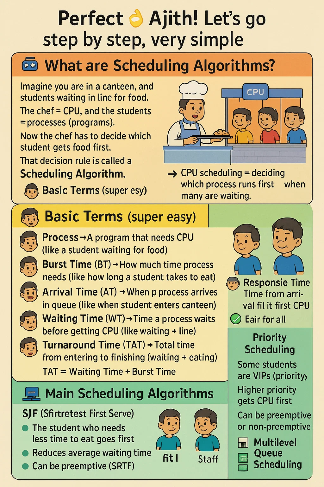

Perfect 👌 Ajith! Let’s go step by step, very **simple** (like I’m teaching a kid).

---

## 🎮 What are Scheduling Algorithms?

Imagine you are in a **canteen**, and students are waiting in line for food.
The **chef = CPU**, and the **students = processes (programs)**.

Now the chef has to decide **which student gets food first**.
That **decision rule** is called a **Scheduling Algorithm**.

👉 CPU scheduling = deciding **which process runs first** when many are waiting.

---

## 🧒 Basic Terms (super easy):

1. **Process** → A program that needs CPU (like a student waiting for food).
2. **Burst Time (BT)** → How much time process needs (like how long a student takes to eat).
3. **Arrival Time (AT)** → When the process arrives in the queue (like when student enters canteen).
4. **Waiting Time (WT)** → Time a process waits before getting CPU (like waiting in line).
5. **Turnaround Time (TAT)** → Total time from entering to finishing (waiting + eating).

   $$
   TAT = Waiting Time + Burst Time
   $$
6. **Response Time** → Time from arrival till it first gets CPU.

---

## 🖥️ Main Scheduling Algorithms

### 1. **FCFS (First Come, First Serve)**

* Like a **normal queue in canteen**.
* Whoever comes first, eats first.
* Non-preemptive (once student starts eating, they finish).

✔️ Example:
AT = \[0, 1, 2], BT = \[5, 3, 8]

* P1 comes first → eats (0–5)
* P2 next → (5–8)
* P3 → (8–16)

---

### 2. **SJF (Shortest Job First)**

* The student who needs **less time to eat** goes first.
* Reduces average waiting time.
* Can be **preemptive (SRTF)** or **non-preemptive**.

✔️ Example:
BT = \[6, 8, 7, 3]

* Smallest burst (3) → first.

---

### 3. **Round Robin (RR)**

* Imagine **everyone gets 2 mins to eat**. If not finished, go back in line.
* Time slice = **Quantum**.
* Fair for all.

✔️ Example: Quantum = 2

* P1 (needs 5) → eats 2, goes back
* P2 (needs 3) → eats 2, goes back
* P3 (needs 1) → finishes
* Continue till all finish.

---

### 4. **Priority Scheduling**

* Some students are **VIPs** (priority).
* Higher priority gets CPU first.
* Can be **preemptive or non-preemptive**.

---

### 5. **Multilevel Queue Scheduling**

* Different queues:

  * VIP students
  * Normal students
  * Staff
* Each queue has own rule.

---

## 🧾 Comparison Table

| Algorithm  | Type           | Fairness  | Avg Waiting Time | Example use            |
| ---------- | -------------- | --------- | ---------------- | ---------------------- |
| FCFS       | Non-preemptive | Simple    | May be high      | Batch systems          |
| SJF        | Both           | Good      | Best (optimal)   | Scheduling short tasks |
| RR         | Preemptive     | Very fair | Moderate         | Time-sharing systems   |
| Priority   | Both           | Depends   | Starvation issue | Real-time systems      |
| Multilevel | Both           | Flexible  | Depends          | Complex OS             |

---

💡 **Trick to master**:

1. Learn formula for **WT, TAT, Avg**.
2. Practice **Gantt charts** (like drawing time line).
3. Solve problems (start from FCFS → RR → Priority → SJF).

---

👉 Do you want me to **start solving examples step by step** (with Gantt chart), like a teacher on board?

