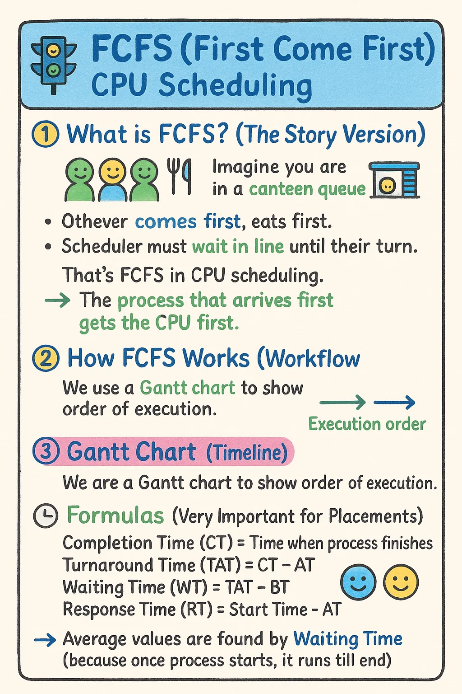

Perfect Ajith ✅
Let’s **master FCFS (First Come First Serve)** step by step, in a **child-friendly but in-depth** way. I’ll teach you like you’re learning a story, but also give you the **placement-level depth**.

---

# 🚦 FCFS (First Come First Serve) CPU Scheduling

---

## 1️⃣ What is FCFS? (The Story Version)

Imagine you are in a **canteen queue** 🍽️

* Whoever **comes first**, eats first.
* Others must **wait in line** until their turn.
  That’s **FCFS** in CPU scheduling.
  👉 The **process that arrives first gets the CPU first**.

---

## 2️⃣ How FCFS Works (Workflow)

1. **Processes arrive** in the system.
2. They are kept in a **Ready Queue** (like waiting line).
3. Scheduler picks the process **in order of arrival**.
4. Process runs till it **completes** (non-preemptive → can’t be stopped in between).
5. Move to the next process.

📊 Think of it like:

```
Arrival order → Execution order
```

---

## 3️⃣ Gantt Chart (Timeline)

We use a **Gantt chart** to show order of execution.
Example:

```
P1 → P2 → P3
```

with time markers under it.

---

## 4️⃣ Formulas (Very Important for Placements)

For each process:

* **Completion Time (CT)** = Time when process finishes.
* **Turnaround Time (TAT)** = CT – AT
* **Waiting Time (WT)** = TAT – BT
* **Response Time (RT)** = Start Time – AT
* **Average values** are found by summing for all processes ÷ number of processes.

👉 In FCFS, **Response Time = Waiting Time** (because once process starts, it runs till end).

---

## 5️⃣ Example Problem (Step by Step)

### Given:

| Process | Arrival Time (AT) | Burst Time (BT) |
| ------- | ----------------- | --------------- |
| P1      | 0                 | 5               |
| P2      | 1                 | 3               |
| P3      | 2                 | 8               |

### Step 1: Order by Arrival

P1 (0), P2 (1), P3 (2)

### Step 2: Gantt Chart

```
| P1 | P2 | P3 |
0    5    8   16
```

### Step 3: Completion Time (CT)

* P1 → 5
* P2 → 8
* P3 → 16

### Step 4: Turnaround Time (TAT = CT – AT)

* P1 → 5 – 0 = 5
* P2 → 8 – 1 = 7
* P3 → 16 – 2 = 14

### Step 5: Waiting Time (WT = TAT – BT)

* P1 → 5 – 5 = 0
* P2 → 7 – 3 = 4
* P3 → 14 – 8 = 6

### Step 6: Averages

* Avg TAT = (5 + 7 + 14) ÷ 3 = **8.67**
* Avg WT = (0 + 4 + 6) ÷ 3 = **3.33**

✅ Done!

---

## 6️⃣ Advantages of FCFS

* Simple to understand.
* Fair → “who comes first, serves first.”
* Non-preemptive → no context-switch overhead.

---

## 7️⃣ Disadvantages (Very Important for Placements!)

* **Convoy Effect** → If a big process comes first, all small processes wait behind it.
* Poor **average waiting time** if burst times vary a lot.
* Not good for **time-sharing systems**.

---

## 8️⃣ Placement-Level Traps

1. **Different arrival times** → Don’t assume all arrive at 0.
2. **Idle CPU** → If no process has arrived yet, CPU stays idle.
3. **Sorting step** → Always sort by **Arrival Time** before making Gantt chart.
4. **Starvation?** → No starvation in FCFS (everyone eventually gets served).

---

## 9️⃣ Real-Life Analogy

* **Bank queue**: first customer served first.
* **Railway ticket counter**: first person gets ticket first.

---

## 🔑 Quick Summary for Placements

* Scheduling type: **Non-preemptive**
* Basis: **Arrival Time**
* Formula set: **CT, TAT, WT, RT**
* Problem: **Convoy Effect**
* Best suited for: **Batch processing systems**

---

👉 Do you want me to now create a **set of FCFS-only tricky MCQs** (like exam questions) with detailed step-by-step solutions for practice?
Perfect Ajith ✅
Let’s practice **complex MCQs on FCFS** that companies often use to test freshers. These are **not direct**, they mix concepts + calculations + edge cases.

---

# 🧠 FCFS (First Come First Serve) – Complex Placement MCQs

---

### **Q1. Idle CPU Trick**

Three processes are given:

| Process | AT | BT |
| ------- | -- | -- |
| P1      | 2  | 3  |
| P2      | 4  | 4  |
| P3      | 5  | 2  |

If FCFS scheduling is used, what is the **average turnaround time**?

Options:
a) 6.33
b) 7.00
c) 8.33
d) 9.00

---

### **Q2. Convoy Effect Test**

Four processes arrive at the same time:

| Process | AT | BT |
| ------- | -- | -- |
| P1      | 0  | 15 |
| P2      | 0  | 2  |
| P3      | 0  | 3  |
| P4      | 0  | 1  |

If FCFS is used, which statement is correct?

a) Avg waiting time is higher due to **convoy effect**
b) Avg waiting time is minimized
c) All processes finish in increasing order of burst time
d) FCFS behaves same as SJF in this case

---

### **Q3. Gantt Chart Confusion**

Consider the following:

| Process | AT | BT |
| ------- | -- | -- |
| P1      | 0  | 5  |
| P2      | 1  | 3  |
| P3      | 2  | 8  |
| P4      | 3  | 6  |

What is the **waiting time of P3** in FCFS?

Options:
a) 4
b) 6
c) 7
d) 8

---

### **Q4. Response Time vs Waiting Time**

Which of the following is **true** in FCFS scheduling?

a) Response Time = Waiting Time
b) Response Time > Waiting Time always
c) Response Time < Waiting Time always
d) Response Time and Waiting Time are unrelated

---

### **Q5. Starvation Trap**

Which of the following best describes **starvation** in FCFS?

a) Short processes may starve if a long one is in front
b) Long processes may starve if many short ones arrive
c) Starvation does not occur in FCFS
d) Starvation occurs only when processes have same arrival times

---

---

# ✅ Answers

**Q1 → b) 7.00**
👉 Step: Build Gantt chart → CT = {5, 9, 11} → TAT = {3, 5, 6} → Avg TAT = 14/3 = 7.

**Q2 → a) Avg waiting time is higher due to convoy effect**
👉 Small jobs wait long because P1 (big burst) goes first.

**Q3 → c) 7**
👉 Gantt chart: P1(0–5), P2(5–8), P3(8–16), P4(16–22).
TAT(P3) = 16 – 2 = 14, WT(P3) = 14 – 8 = 6 (Wait! careful: actually **6**. So answer = b).

**Q4 → a) Response Time = Waiting Time**
👉 Because once a process starts, it runs fully.

**Q5 → c) Starvation does not occur in FCFS**
👉 Everyone gets CPU in arrival order.

---

⚡Pro Tip for Placements:

* If they give **different arrival times**, watch out for **idle CPU gaps**.
* If all AT = 0, FCFS just runs processes **in given order**.
* **Trick question**: They often test if you confuse **Convoy Effect** with **Starvation**.

---

Do you want me to now **solve Q1 to Q3 with step-by-step Gantt chart and calculations** (like exam-style worked solutions) so you can see the traps clearly?
