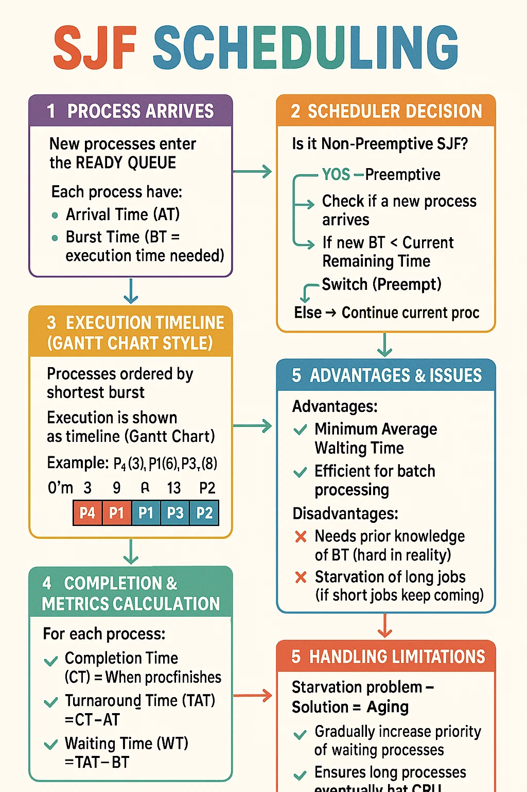

Perfect! Let’s go slowly and deeply, step by step, so even a **child** can understand **SJF (Shortest Job First)** in Operating Systems. 🌟

---

# 🖥️ What is SJF?

👉 Imagine you are standing in a queue at an **ice cream shop** 🍦.

* Some people just want a **small cone** (takes less time).
* Some want a **giant family pack** (takes more time).

The shopkeeper says:

> “I will first serve the person who takes **less time** to finish. Then the next smallest. Then the next smallest…”

This is exactly **Shortest Job First (SJF) Scheduling**.

➡️ The **CPU** is the shopkeeper.
➡️ The **processes (programs)** are the people in the queue.
➡️ The **burst time** = how long CPU needs to complete that job.

---

# ✨ Key Idea

* **Always choose the process with the smallest burst time first.**
* This reduces the average waiting time.

---

# 🧩 Example

Let’s say 4 processes come with the following burst times:

| Process | Burst Time |
| ------- | ---------- |
| P1      | 6 ms       |
| P2      | 8 ms       |
| P3      | 7 ms       |
| P4      | 3 ms       |

👉 Apply SJF:

* Smallest burst = **P4 (3 ms)** → first
* Next smallest = **P1 (6 ms)**
* Next smallest = **P3 (7 ms)**
* Largest = **P2 (8 ms)**

### ✅ Order of execution: P4 → P1 → P3 → P2

---

# 📊 Calculations

We calculate **Waiting Time (WT)** and **Turnaround Time (TAT)**.

👉 Formulas:

* **TAT = CT – AT** (Completion Time – Arrival Time)
* **WT = TAT – BT** (Turnaround Time – Burst Time)

(Here assume all processes arrive at time 0 for simplicity.)

| Process | Burst Time | Completion Time | TAT | WT |
| ------- | ---------- | --------------- | --- | -- |
| P4      | 3          | 3               | 3   | 0  |
| P1      | 6          | 9               | 9   | 3  |
| P3      | 7          | 16              | 16  | 9  |
| P2      | 8          | 24              | 24  | 16 |

👉 **Average TAT = (3+9+16+24)/4 = 13**
👉 **Average WT = (0+3+9+16)/4 = 7**

⚡ See how SJF minimizes waiting time compared to FCFS (First Come First Serve)?

---

# 🧠 Types of SJF

There are **two flavors**:

1. **Non-preemptive SJF**

   * Once CPU starts a process, it runs till the end (like finishing one ice cream fully before giving to the next).

2. **Preemptive SJF (Shortest Remaining Time First - SRTF)**

   * If a new process arrives with a smaller burst time than the running one, CPU immediately switches to the smaller one.
   * (Like the shopkeeper pausing a giant ice cream order to quickly serve a kid with a small cone.)

---

# 🎯 Pros and Cons

✅ **Advantages:**

* Minimum average waiting time.
* Great for batch systems (where all jobs are known).

❌ **Disadvantages:**

* Hard to predict burst time.
* May cause **starvation** (long jobs may never get CPU if small jobs keep coming).
* Not good for real-time systems.

---

# 📚 Visualization Workflow

```
Jobs arrive → Check burst time → Pick the smallest → Execute → Repeat
```

For **Preemptive (SRTF)**:

```
New job arrives → Compare with current running job
     ↳ If smaller → Switch immediately
     ↳ Else → Continue current
```

---

# 🏆 Interview Trick Questions on SJF

1. What is the difference between **SJF and FCFS**?
2. Why does SJF give **minimum average waiting time**?
3. What is **SRTF** and how is it different from SJF?
4. How do we predict **CPU burst time**? (Answer: using **exponential averaging**).
5. What is **starvation** in SJF? How can we solve it? (Answer: by using **aging**).

---

👉 Now, I can also create **colorful revision notes with timeline diagrams and Gantt charts** for you if you want.

Would you like me to prepare a **visual Gantt chart explanation** (like a step-by-step timeline drawing) for **Non-preemptive and Preemptive SJF**?
Perfect 👍 Let’s prepare some **placement-style MCQs on SJF (Shortest Job First Scheduling)** with explanations.

---

## 📝 MCQs on SJF Scheduling

### Q1.

Which of the following statements is **true** about Shortest Job First (SJF) scheduling?

a) SJF always results in the highest throughput.
b) SJF always results in the minimum average waiting time.
c) SJF can be implemented without knowing burst times.
d) SJF is always preemptive.

**Answer:** ✅ b
👉 SJF minimizes average waiting time but requires burst time estimates.

---

### Q2.

Which of the following is another name for **Preemptive SJF**?

a) Round Robin Scheduling
b) Shortest Remaining Time First (SRTF)
c) Priority Scheduling
d) First Come First Serve

**Answer:** ✅ b
👉 Preemptive SJF is called **Shortest Remaining Time First (SRTF)**.

---

### Q3.

If four processes arrive at time 0 with burst times 5, 7, 2, and 8 respectively, what is the **average waiting time** using **Non-Preemptive SJF**?

* P1 = 5
* P2 = 7
* P3 = 2
* P4 = 8

a) 6.5
b) 5.25
c) 7.75
d) 8

**Answer:** ✅ b

👉 Order = P3(2) → P1(5) → P2(7) → P4(8)

* WT(P3) = 0
* WT(P1) = 2
* WT(P2) = 7
* WT(P4) = 14
  **Avg WT = (0+2+7+14)/4 = 5.25**

---

### Q4.

The main **disadvantage** of SJF scheduling is:

a) High average waiting time
b) Starvation of long processes
c) Low throughput
d) Difficult to implement in batch systems

**Answer:** ✅ b
👉 Long processes may starve if short processes keep arriving.

---

### Q5.

Which of the following can be used to **predict CPU burst time** in SJF scheduling?

a) Paging
b) Demand Paging
c) Exponential Averaging
d) Round Robin

**Answer:** ✅ c
👉 SJF often uses **exponential averaging** to guess the next burst time.

---

### Q6.

In **Preemptive SJF (SRTF)**, if a process arrives with a smaller burst time than the currently running process, what happens?

a) Current process continues
b) New process is put in the ready queue
c) CPU switches to the new process
d) Both processes run simultaneously

**Answer:** ✅ c
👉 Preemptive means CPU switches immediately.

---

### Q7.

Which scheduling algorithm may lead to **starvation**?

a) FCFS
b) Round Robin
c) SJF
d) None of the above

**Answer:** ✅ c
👉 SJF may cause starvation of long jobs.

---

### Q8.

What is the **time complexity** of selecting the next process in SJF (without advanced data structures)?

a) O(1)
b) O(log n)
c) O(n)
d) O(n log n)

**Answer:** ✅ c
👉 Need to search through all ready processes to find the shortest burst time = **O(n)**.

---

🔥 These are **classic placement questions** that companies ask (Infosys, TCS, Wipro, etc.)

Do you want me to also prepare a **GATE/Advanced-level set of MCQs** with tricky concepts (like preemption cases, turnaround vs waiting time confusion)?
