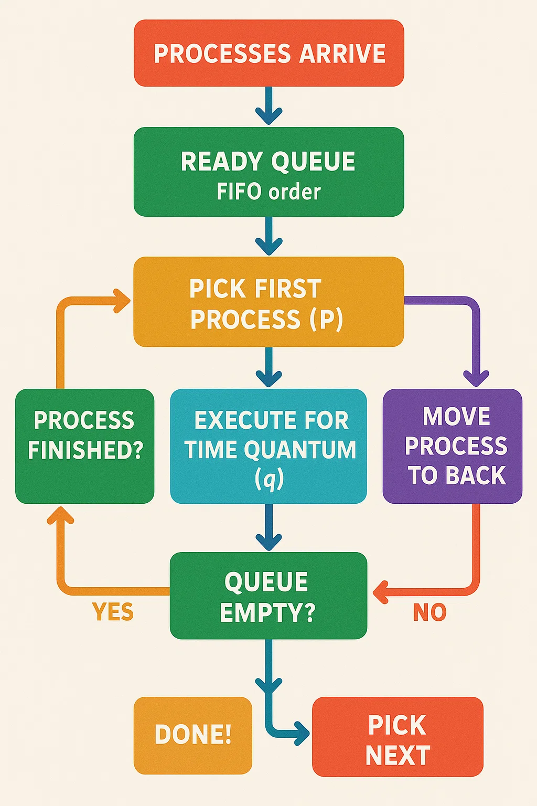

Absolutely! Here's a **visual workflow diagram for Round Robin Scheduling** in a **text-based, easy-to-understand format** suitable for placements:

---

```
+----------------+
| Processes arrive|
+--------+-------+
         |
         v
+----------------+
|  Ready Queue   |  <- FIFO order
+--------+-------+
         |
         v
+------------------------+
| Pick first process (P) |
+-----------+------------+
            |
            v
+-----------------------------+
| Execute for Time Quantum (q)|
+-----------+-----------------+
            |
      +-----+-----+
      |           |
      v           v
+----------------------+   +-------------------+
| Process finished?    |   | Remaining burst > 0|
+---------+------------+   +---------+---------+
          |                          |
          | Yes                      | No
          v                          v
+----------------------+   +----------------------+
| Remove from queue     |   | Move process to back |
+----------+-----------+   +----------+-----------+
           |                          |
           +-----------+--------------+
                       |
                       v
               +---------------+
               | Queue empty?  |
               +-------+-------+
                       |
             +---------+---------+
             |                   |
             v                   v
        +---------+         +------------+
        | Done!   |         | Pick next |
        +---------+         +------------+
```

---

✅ **How to read it:**

1. Processes enter the **ready queue**.
2. CPU picks the **first process** in queue.
3. Executes it for **time quantum q**.
4. If the process **finishes**, remove it; otherwise, **move it to the back**.
5. Repeat until **queue is empty**.

---

I can also make a **colorful, step-by-step Gantt chart workflow** that visually shows **process execution timeline for RR**, which is very helpful for placements.

Do you want me to make that?
