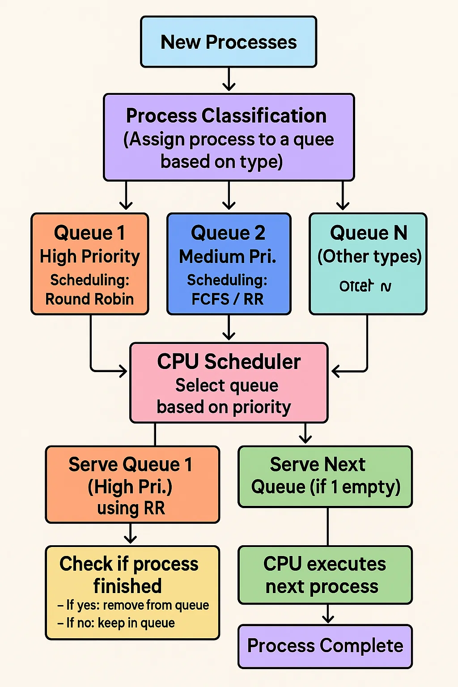

Absolutely! Let's dive deep into **Multilevel Queue Scheduling (MLQ) in Operating Systems**. I’ll break it down into simple, understandable parts with examples, diagrams, and important points for mastery.

---

## **1. What is Multilevel Queue Scheduling?**

**Definition:**
Multilevel Queue Scheduling is a CPU scheduling algorithm where **processes are divided into multiple queues**, and **each queue has its own scheduling algorithm**. It is mainly used when processes have **different priority levels or characteristics**.

Think of it like a **queue system in a bank**: VIP customers, regular customers, and business customers each have their own line, and the bank serves them differently.

---

## **2. Key Characteristics**

1. **Multiple Queues:**

   * Each queue represents a **different priority level** or **process type**.
   * Examples:

     * System processes (highest priority)
     * Interactive processes (medium priority)
     * Batch processes (lowest priority)

2. **Scheduling Within Queues:**

   * Each queue can have its **own scheduling algorithm**, like:

     * **FCFS** for batch jobs
     * **Round Robin (RR)** for interactive jobs
     * **Priority Scheduling** for system jobs

3. **Scheduling Between Queues:**

   * The system needs a **method to decide which queue to serve**:

     * **Fixed priority:** Higher priority queues are served first.
     * **Time slice:** Each queue gets a certain amount of CPU time (less common).

4. **No Process Movement Between Queues (Classic MLQ):**

   * Once a process is assigned to a queue, it **stays there**.

---

## **3. Structure / Representation**

```
       CPU
       ‚Üë
  -----------------
  | Queue 1 (RR)  |  ‚Üê Highest Priority
  -----------------
  | Queue 2 (FCFS)|  ‚Üê Medium Priority
  -----------------
  | Queue 3 (FCFS)|  ‚Üê Lowest Priority
  -----------------
```

* Processes in **Queue 1** are always served before **Queue 2**, and so on.
* Within each queue, its own scheduling rules apply.

---

## **4. How It Works (Step by Step)**

Let’s consider **3 queues**:

1. **Queue 1:** System processes (Priority 1) – **Round Robin**
2. **Queue 2:** Interactive processes – **Round Robin**
3. **Queue 3:** Batch processes – **FCFS**

**Example:**

| Process | Queue | Arrival | Burst |
| ------- | ----- | ------- | ----- |
| P1      | 1     | 0       | 4     |
| P2      | 2     | 1       | 6     |
| P3      | 1     | 2       | 3     |
| P4      | 3     | 3       | 5     |

**Step 1:** Serve Queue 1 (highest priority) first using RR.
**Step 2:** If Queue 1 is empty, serve Queue 2.
**Step 3:** Queue 3 is served only if Queue 1 and Queue 2 are empty.

---

## **5. Advantages**

1. Suitable for **processes with different priorities**.
2. **Predictable:** High-priority processes are served first.
3. Flexible: Each queue can have a different scheduling policy.

---

## **6. Disadvantages**

1. **Starvation:** Low-priority queues may never get CPU if higher-priority queues are always busy.
2. **Rigid structure:** Processes **cannot move between queues** (classic MLQ).
3. Complex to configure with many queues and scheduling policies.

---

## **7. Variants / Enhancements**

1. **Multilevel Feedback Queue (MLFQ):**

   * Allows **processes to move between queues** based on behavior or aging.
   * Helps **avoid starvation** of low-priority processes.

2. **Time Slice Allocation:**

   * Each queue gets a **time slice**, preventing complete starvation of lower-priority queues.

---

## **8. Real-world Analogy**

Imagine a hospital:

* **Emergency patients (Queue 1)** ‚Üí Immediate attention (RR within small groups)
* **Regular appointments (Queue 2)** ‚Üí Scheduled based on arrival (FCFS)
* **Walk-ins (Queue 3)** ‚Üí Wait until others are done

---

## **9. Important Notes for Mastery**

* **MLQ = Fixed queue assignment, no movement.**
* **MLFQ = Dynamic movement, avoids starvation.**
* Understand **scheduling algorithms within each queue**.
* Can combine with **priority scheduling** to serve critical processes first.
* Draw **Gantt charts** to visualize process execution across queues.

---

If you want, I can create a **step-by-step example with a Gantt chart** for 3 queues so you can see **exactly how processes are scheduled and CPU is allocated**.

Do you want me to do that next?
Absolutely! Here’s a **list of top interview questions** on **Multilevel Queue Scheduling (MLQ)** in Operating Systems, along with tips on how to answer them:

---

## **1. Basic Understanding Questions**

**Q1. What is Multilevel Queue Scheduling?**

* Explain that MLQ is a CPU scheduling algorithm where processes are divided into **multiple queues based on type or priority**, each queue can have **its own scheduling algorithm**, and higher-priority queues are served first.

**Q2. How does it differ from Multilevel Feedback Queue Scheduling (MLFQ)?**

* MLQ: **Static queue assignment**, processes do not move between queues.
* MLFQ: **Dynamic queue assignment**, processes can move between queues based on behavior or aging, preventing starvation.

**Q3. What are the main characteristics of Multilevel Queue Scheduling?**

* Multiple queues, each queue has its own scheduling algorithm.
* Priority-based scheduling between queues.
* Processes **do not move between queues**.

---

## **2. Process & Algorithm Questions**

**Q4. How are processes assigned to queues?**

* Based on **process type**, **priority**, or **CPU/IO-bound nature**.
* Example:

  * System processes ‚Üí Queue 1 (highest priority)
  * Interactive processes ‚Üí Queue 2
  * Batch processes ‚Üí Queue 3 (lowest priority)

**Q5. What scheduling algorithms are used within queues?**

* Can use any algorithm depending on the process type:

  * FCFS (First-Come-First-Serve)
  * Round Robin (RR)
  * Priority Scheduling

**Q6. How is CPU allocated among queues?**

* **Fixed priority:** Serve the highest-priority non-empty queue first.
* **Time slice / cyclic:** Each queue gets a defined time slice (less common).

---

## **3. Advantage / Disadvantage Questions**

**Q7. What are the advantages of Multilevel Queue Scheduling?**

* Handles processes with **different priorities efficiently**.
* Predictable scheduling for critical processes.
* Flexible – each queue can have its own algorithm.

**Q8. What are the disadvantages of MLQ?**

* **Starvation:** Low-priority queues may never get CPU.
* Rigid structure; cannot move processes between queues.
* Complex to configure with multiple queues.

---

## **4. Scenario / Problem-Solving Questions**

**Q9. Give an example of Multilevel Queue Scheduling with processes and burst times.**

* You may be asked to **draw a Gantt chart** showing CPU allocation for 2–3 queues.
* Be ready to explain **which process runs first, how long, and when the CPU switches queues**.

**Q10. How do you prevent starvation in MLQ?**

* Use **aging** (increase priority of waiting processes).
* Better approach: use **Multilevel Feedback Queue Scheduling (MLFQ)**.

**Q11. Can you combine MLQ with priority scheduling?**

* Yes, higher-priority queues can use **priority scheduling within the queue**.

---

## **5. Advanced / Conceptual Questions**

**Q12. What is the difference between MLQ and simple priority scheduling?**

* Priority scheduling: single queue, priorities decide CPU allocation.
* MLQ: multiple queues, each can have **different scheduling policies**; **priority between queues**, not just processes.

**Q13. How is MLQ used in real-world systems?**

* OS like **Windows and UNIX** use variations for **system, interactive, and batch processes**.
* Used in **time-sharing systems** to handle multiple process types efficiently.

**Q14. Explain the workflow of MLQ with a diagram.**

* Draw a simple diagram:

  ```
  Queue 1 (High) ‚Üí CPU
  Queue 2 (Medium) ‚Üí CPU (if Queue 1 empty)
  Queue 3 (Low) ‚Üí CPU (if Queue 1 & 2 empty)
  ```

---

üí° **Tips for Interviews:**

1. Always **mention priority between queues** and **different algorithms within queues**.
2. **Draw diagrams or Gantt charts** when asked about examples.
3. Be ready to **compare MLQ and MLFQ** – this is a very common follow-up.
4. Know **advantages, disadvantages, and starvation solutions**.

---

If you want, I can create a **short, ready-to-memorize cheat sheet** of **MLQ interview questions with crisp answers**, so you can revise quickly before an interview.

Do you want me to do that?
