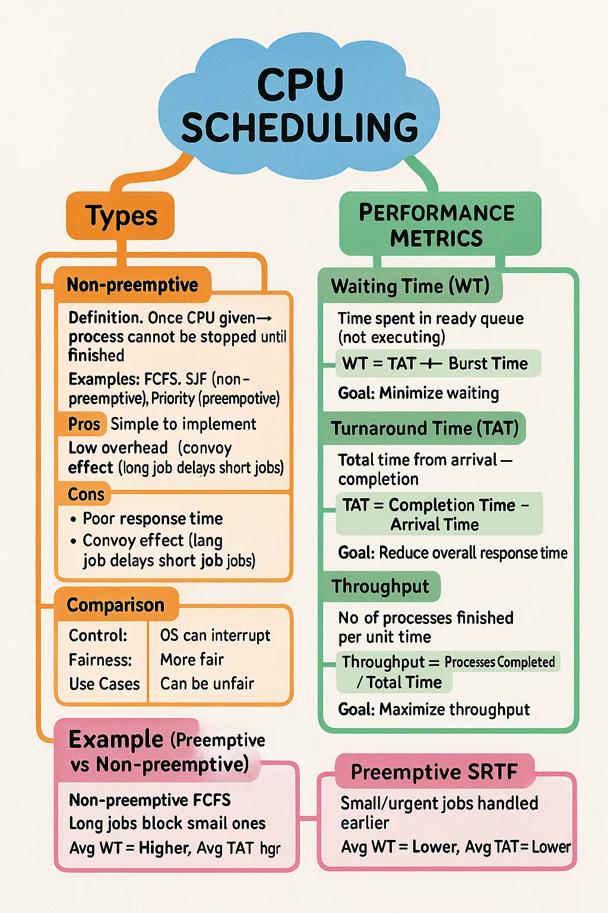

Perfect 👍 Let’s break this into **very simple but in-depth notes** so you can **master Preemptive vs Non-preemptive Scheduling** and the related **performance metrics**.

---

# 🎯 **Preemptive vs Non-preemptive Scheduling**

## 1️⃣ **Non-preemptive Scheduling**

* Once a process **starts executing**, it **cannot be stopped** until it finishes or voluntarily gives up (I/O request).
* Example: **First Come First Serve (FCFS), Shortest Job First (SJF non-preemptive).**
* ✅ Simpler to implement.
* ❌ Can cause **long waiting times** for short processes if a long process is already running (convoy effect).

👉 **Analogy:** Think of one person at a counter. Once they start, no one can interrupt them until they finish.

---

## 2️⃣ **Preemptive Scheduling**

* The OS can **suspend a running process** and switch to another if needed (based on priority or time slice).
* Example: **Round Robin (RR), Shortest Remaining Time First (SRTF), Priority (Preemptive).**
* ✅ More **responsive** (better for interactive systems).
* ❌ Higher **overhead** due to frequent context switching.

👉 **Analogy:** Like multiple people in a queue, but if someone more important arrives, the current person is asked to step aside for a while.

---

# ⚡ **Key Differences**

| Aspect         | Preemptive                      | Non-preemptive                  |
| -------------- | ------------------------------- | ------------------------------- |
| Control        | CPU can be taken away           | CPU cannot be taken away        |
| Fairness       | More fair to small/urgent tasks | Large jobs can block small ones |
| Context Switch | High (frequent)                 | Low (rare)                      |
| Examples       | RR, SRTF, Priority (preemptive) | FCFS, SJF (non-preemptive)      |

---

# 📊 **Performance Metrics**

These are used to **measure efficiency** of scheduling:

---

## 1️⃣ **Waiting Time (WT)**

* Time a process spends **waiting in the ready queue** before getting CPU.
* Formula:

  $$
  \text{WT} = \text{Turnaround Time} - \text{Burst Time}
  $$

👉 **Goal:** Minimize waiting time.
👉 Example: If a process arrives at 0, starts at 5, burst = 4 → waiting time = 5 - 0 = **5**.

---

## 2️⃣ **Turnaround Time (TAT)**

* **Total time** from arrival → completion.
* Formula:

  $$
  \text{TAT} = \text{Completion Time} - \text{Arrival Time}
  $$

👉 **Goal:** Reduce turnaround time for better performance.
👉 Example: Arrival = 0, Completion = 10 → TAT = **10**.

---

## 3️⃣ **Throughput**

* **Number of processes completed per unit time.**
* Formula:

  $$
  \text{Throughput} = \frac{\text{No. of processes completed}}{\text{Total time}}
  $$

👉 **Goal:** Maximize throughput (finish more processes in less time).

---

# 🧠 **Quick Example**

Suppose 3 processes:

| Process | Arrival | Burst |
| ------- | ------- | ----- |
| P1      | 0       | 5     |
| P2      | 1       | 3     |
| P3      | 2       | 1     |

---

### ⚙️ **Non-preemptive FCFS**

Order → P1 → P2 → P3

* P1: WT = 0, TAT = 5
* P2: WT = 4, TAT = 7
* P3: WT = 6, TAT = 7

**Avg WT = (0+4+6)/3 = 3.33**
**Avg TAT = (5+7+7)/3 = 6.33**

---

### ⚙️ **Preemptive SRTF**

Order → P1 (0–1) → P2 (1–2) → P3 (2–3) → P2 (3–5) → P1 (5–9)

* P1: WT = 4, TAT = 9
* P2: WT = 1, TAT = 4
* P3: WT = 0, TAT = 1

**Avg WT = (4+1+0)/3 = 1.67**
**Avg TAT = (9+4+1)/3 = 4.67**

👉 Preemptive gives better **response & waiting time**.

---

# 🌟 **Memory Hack (To Remember)**

* **Non-preemptive → Simple, but unfair.**
* **Preemptive → Fair, but costly (context switches).**
* **WT → Time in queue.**
* **TAT → Whole journey.**
* **Throughput → Speed of finishing jobs.**

---

Do you want me to also make a **mindmap-style visual text flow** (like a diagram in text form) for quick revision of these concepts?

Great idea 👍 Let’s prepare **top 5 interview questions with answers** on
👉 **Preemptive vs Non-preemptive Scheduling & Performance Metrics**

---

# 🎯 Top 5 Interview Q\&A

---

### ✅ Q1: What is the difference between **preemptive** and **non-preemptive** scheduling?

**Answer:**

* **Preemptive:** CPU can be taken away from a running process and given to another (e.g., Round Robin, SRTF).

  * Pros: Better responsiveness, fair to small processes.
  * Cons: More context switching overhead.
* **Non-preemptive:** Once a process starts, it cannot be stopped until it finishes or waits for I/O (e.g., FCFS, SJF).

  * Pros: Simpler, less overhead.
  * Cons: Convoy effect, poor response time.

👉 Key line: *Preemptive = interruption allowed, Non-preemptive = no interruption.*

---

### ✅ Q2: What is **Waiting Time** and how do you calculate it?

**Answer:**

* **Definition:** Time a process spends waiting in the **ready queue** before it gets CPU.
* **Formula:**

  $$
  WT = TAT - Burst\ Time
  $$
* **Goal:** Minimize waiting time to improve user satisfaction.

👉 Example:

* Process arrival = 0, burst = 5, completion = 12
* TAT = 12 – 0 = 12
* WT = 12 – 5 = **7**

---

### ✅ Q3: What is **Turnaround Time**? How is it different from Waiting Time?

**Answer:**

* **Turnaround Time (TAT):** Total time from process **arrival → completion**.

  $$
  TAT = Completion\ Time - Arrival\ Time
  $$
* **Waiting Time (WT):** Part of TAT spent waiting in the ready queue.

  $$
  WT = TAT - Burst\ Time
  $$
* **Difference:**

  * TAT measures the **whole journey** of a process.
  * WT measures only the **idle waiting** part.

---

### ✅ Q4: What is **Throughput** and why is it important?

**Answer:**

* **Definition:** Number of processes completed per unit time.
* **Formula:**

  $$
  Throughput = \frac{Processes\ Completed}{Total\ Time}
  $$
* **Importance:**

  * Higher throughput → system handles more jobs in less time.
  * It reflects **system efficiency**.

👉 Example: 5 processes finished in 20 seconds → Throughput = 5/20 = **0.25 processes/second**.

---

### ✅ Q5: Why is **preemptive scheduling** preferred in interactive systems?

**Answer:**

* Interactive systems (e.g., operating systems for PCs, mobiles) need **quick responses** to user input.
* Preemptive scheduling ensures:

  * Short/urgent jobs (like keystrokes, clicks) don’t wait behind long jobs.
  * Better **response time** and **fairness**.
* Non-preemptive would cause delays because long-running jobs can block user tasks.

👉 Example: If a video rendering job (long) is running, and a user clicks a button → preemptive scheduling lets the button process run **immediately**.

---

⚡ Quick Tip for Interviews:
Always support your answer with:

* **Definition**
* **Formula (if metric)**
* **Example**
* **Pros/Cons or Use case**

---

Do you want me to also give you a **practice problem (with Gantt chart + calculation of WT, TAT, Throughput)** so you can strengthen this topic hands-on?
