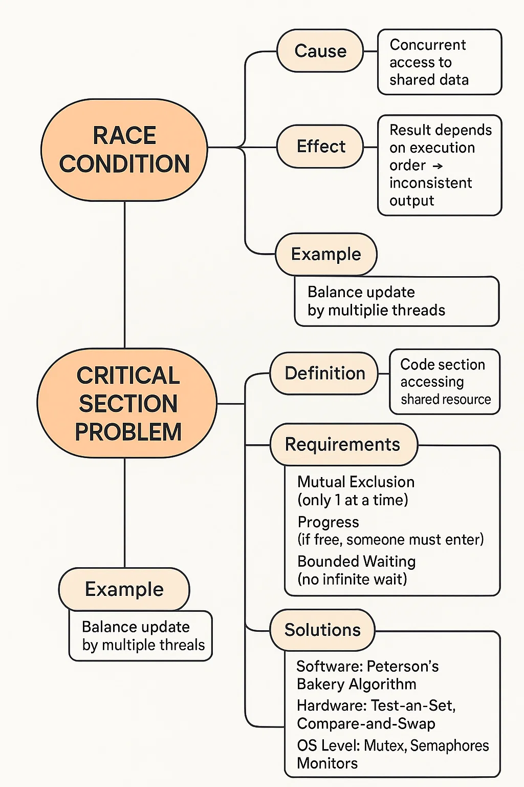

Perfect 👍 This is one of the **core OS concepts** and often asked in interviews. Let’s make **Race Conditions & Critical Section Problem** super clear step by step.

---

# 🏃‍♂️ Race Condition

### 🔹 **Definition**

* A **race condition** occurs when **two or more processes/threads** access **shared data** at the same time, and the final outcome depends on the **timing/order of execution**.
* Uncontrolled interleaving → **wrong/unstable results**.

👉 Example:

* Shared variable `x = 10`
* Process P1 does `x = x + 1`
* Process P2 does `x = x - 1`

If both run at the same time without synchronization:

* Expected: (10+1-1) = 10
* Actual: Could be 9 or 11 (depends on interleaving).

---

# 🔐 Critical Section

### 🔹 **Definition**

* The **critical section** is the part of code where **shared resources/data** are accessed or modified.
* Only **one process** should be in the critical section at a time to avoid race conditions.

👉 Analogy:
Imagine a single-lane bridge (critical section). Only **one car** (process) can cross at a time to avoid a collision.

---

# 🛠️ Requirements of Critical Section Problem

To design a correct solution, 3 conditions must be satisfied:

1️⃣ **Mutual Exclusion**

* Only **one process** can be in its critical section at a time.
* Prevents race conditions.

2️⃣ **Progress**

* If no process is in the critical section, one of the waiting processes must be allowed to enter (no unnecessary blocking).

3️⃣ **Bounded Waiting (Fairness)**

* A process should not wait **forever** to enter the critical section (avoid starvation).

---

# 📌 Solutions to Critical Section Problem

### 1. **Software Solutions** (Early approaches)

* Peterson’s Algorithm
* Bakery Algorithm

### 2. **Hardware Solutions**

* Disable interrupts (not scalable)
* Special atomic instructions (Test-and-Set, Compare-and-Swap, etc.)

### 3. **OS-provided Synchronization**

* Mutex Locks
* Semaphores
* Monitors

---

# ⚡ Quick Example: Peterson’s Algorithm (2-process case)

Shared variables:

* `flag[2]` → indicates if a process wants to enter
* `turn` → whose turn is it

Steps:

* Process Pi sets `flag[i] = true` (wants to enter)
* Gives `turn = j` (lets the other go if needed)
* Enters only if `(flag[j] == false || turn == i)`

This guarantees:

* **Mutual Exclusion** (both can’t enter at once)
* **Progress** (someone enters if possible)
* **Bounded Waiting** (fair turns)

---

# 🌟 Visualization (Mindmap Style)

```
Race Condition
│
├─ Cause: Concurrent access to shared data
├─ Effect: Result depends on execution order → inconsistent output
└─ Example: Balance update by multiple threads

Critical Section Problem
│
├─ Definition: Code section accessing shared resource
├─ Requirements:
│   ├─ Mutual Exclusion (only 1 at a time)
│   ├─ Progress (if free, someone must enter)
│   └─ Bounded Waiting (no infinite wait)
│
├─ Solutions
│   ├─ Software: Peterson’s, Bakery Algorithm
│   ├─ Hardware: Test-and-Set, Compare-and-Swap
│   └─ OS Level: Mutex, Semaphores, Monitors
│
└─ Goal: Prevent race conditions, ensure correctness
```

---

# 🎯 Interview Pointers

* **Definition question:** “What is a race condition?”
* **Concept check:** “What are the requirements of the critical section problem?”
* **Practical:** “Explain Peterson’s algorithm.”
* **Comparison:** “Mutex vs Semaphore vs Monitor.”

---

👉 Do you want me to also give you a **step-by-step worked example** (like with two processes accessing a shared variable) showing how a race condition happens **and how Peterson’s algorithm fixes it**?
Perfect 👌 Let’s prepare some **interview-style MCQs** on
👉 **Race Conditions & Critical Section Problem**

---

# 📝 MCQs with Answers

---

### **Q1.** A race condition occurs when:

A) Two processes share the same code
B) Two processes execute independently without shared data
C) Two or more processes access shared data simultaneously, and the result depends on execution order
D) Two processes run at different speeds

✅ **Answer:** C

---

### **Q2.** The part of a program where a shared resource is accessed is called:

A) Busy Waiting
B) Deadlock
C) Critical Section
D) Starvation

✅ **Answer:** C

---

### **Q3.** Which of the following is **not** a requirement of the Critical Section problem?

A) Mutual Exclusion
B) Progress
C) Bounded Waiting
D) Deadlock Freedom

✅ **Answer:** D
(*Deadlock freedom is desirable but not part of the three classical requirements.*)

---

### **Q4.** Which of the following is a **software solution** to the Critical Section problem?

A) Mutex Locks
B) Peterson’s Algorithm
C) Test-and-Set Instruction
D) Semaphores

✅ **Answer:** B
(*Peterson’s Algorithm is software-based; the others are hardware/OS solutions.*)

---

### **Q5.** In Peterson’s Algorithm, the `turn` variable is used to:

A) Show which process is in its critical section
B) Indicate which process will enter next
C) Count how many processes are waiting
D) Avoid deadlock

✅ **Answer:** B

---

### **Q6.** Which of the following ensures **mutual exclusion** using hardware?

A) Test-and-Set
B) Compare-and-Swap
C) Disabling interrupts
D) All of the above

✅ **Answer:** D

---

### **Q7.** What is the main disadvantage of **preemptive disabling of interrupts** as a critical section solution?

A) It cannot guarantee mutual exclusion
B) It may cause starvation
C) It is not suitable for multiprocessor systems
D) It increases throughput

✅ **Answer:** C

---

### **Q8.** Which one of the following is **true** about semaphores?

A) Semaphore is always a hardware mechanism
B) Semaphore avoids race conditions by allowing only one process in CS at a time
C) Semaphore eliminates deadlock completely
D) Semaphore can only be used in uniprocessor systems

✅ **Answer:** B

---

# 🎯 Quick Recap MCQ Focus

* **Race Condition → Cause & Example**
* **Critical Section → Definition & Requirements**
* **Peterson’s Algorithm → Key Idea**
* **Solutions → Software vs Hardware vs OS**
* **Semaphores/Mutex → Behavior check**

---

Would you like me to now prepare a **“tricky interview coding MCQ”** (like giving a code snippet where two threads modify a variable, and you choose the correct output)? That’s a common way they test **race condition understanding**.
